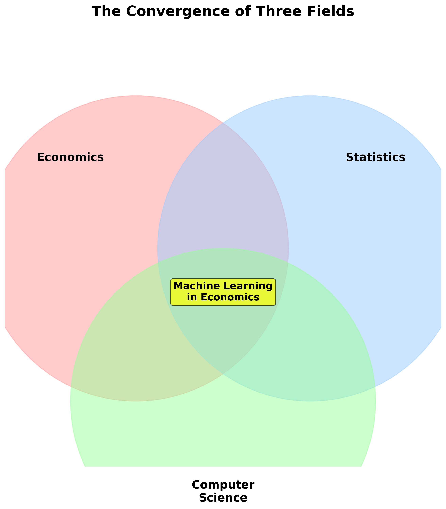
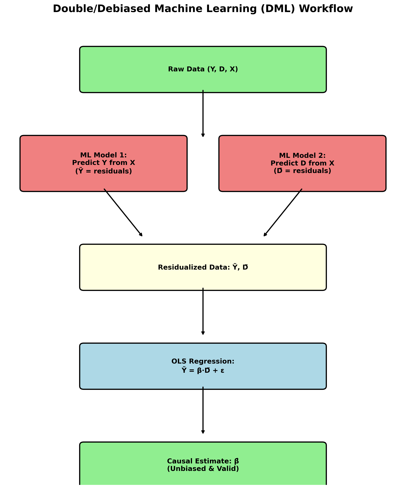
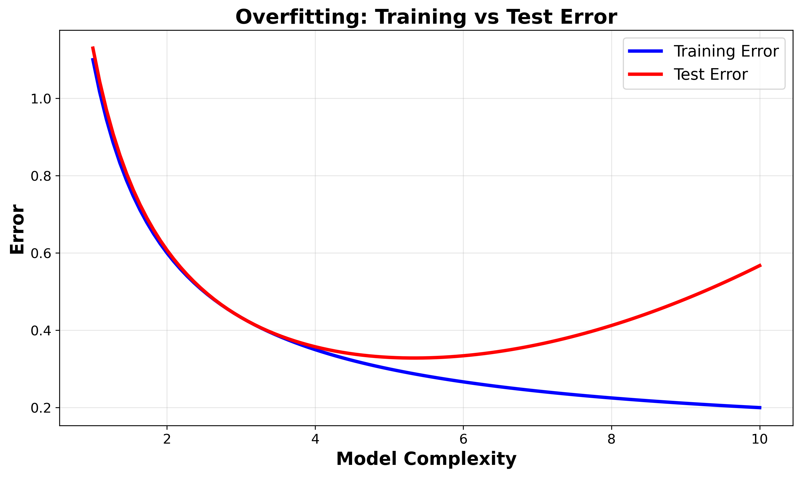
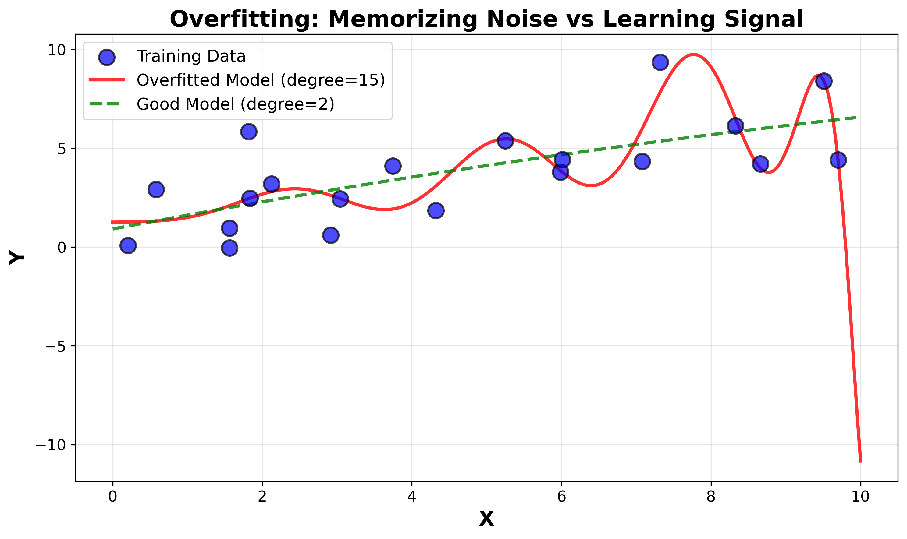
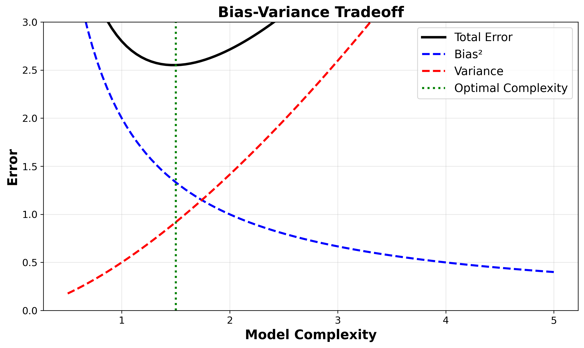
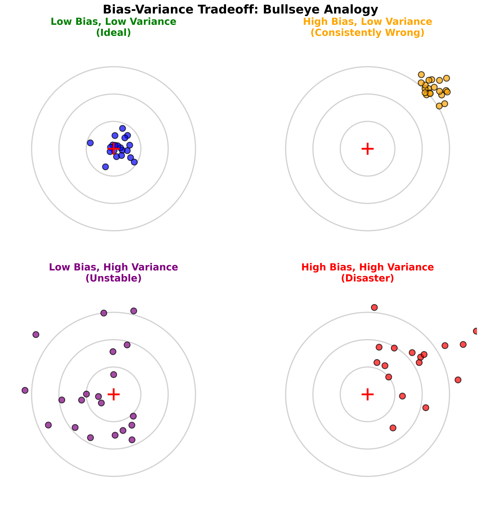

<!-- _class: lead -->

# Lecture 1
## Course Introduction & Supervised Learning Basics

**ECON6083: Machine Learning for Economists**

---

## Today's Roadmap

**1. The Historic Convergence**
   - Econometrics meets Machine Learning
   - Why now? The Big Data era

**2. Three Pillars of ML in Economics**
   - Prediction, Causal Inference, Policy Learning

**3. From OLS to Prediction**
   - The paradigm shift
   - Bias-variance tradeoff

---

<!-- _class: lead -->

# Part 1
## The Historic Convergence of Two Fields

---

## Two Parallel Rivers

**Econometrics** (Economics + Statistics)
- Focus: **Causal Inference** - estimating $\hat{\beta}$
- Questions: "What is the return to education?"
- Priority: Unbiasedness, interpretability

**Machine Learning** (Computer Science)
- Focus: **Prediction** - forecasting $\hat{y}$
- Questions: "Will this user click the ad?"
- Priority: Out-of-sample accuracy

---

## The Big Data Era: Rivers Converge

**Why the convergence?**

Economists realized:
- Many decisions rely on high-quality predictions
- Big data offers unprecedented opportunities

Computer scientists realized:
- Pure prediction fails under policy interventions
- Causal reasoning is essential (Lucas Critique revisited)

**Result**: A new interdisciplinary field emerges

---

## The New Toolkit

**Traditional Econometrics**
- Linear models, IV, DiD, RDD
- Focus on $\beta$ (parameters)

**Machine Learning**
- Neural nets, Random Forests, LASSO
- Focus on $\hat{y}$ (predictions)

**Modern Economics**
- Double ML, Causal Forests, Policy Learning
- Focus on both prediction **and** causation

---

<!-- _class: lead -->

# Part 2
## The Map of ML Applications

---

## Three Pillars of ML in Economics

**1. Pure Prediction**
   - Use ML for forecasting
   - Example: Poverty mapping with satellites

**2. Causal Inference**
   - ML as a tool for better causal estimates
   - Example: Double ML for high-dimensional controls

**3. Policy Learning**
   - Optimal heterogeneous treatment assignment
   - Example: Personalized donation suggestions

---

<!-- _class: lead -->

# Pillar 1
## Pure Prediction

---

## Pure Prediction: Core Logic

**Key insight**: We care about whether $X$ predicts $Y$, not whether $X$ causes $Y$

If a variable improves out-of-sample prediction, it has value
- No need to establish causality
- Focus on $R^2$ and forecast accuracy
- Embrace "black box" models if they work

---

## Case Study: Satellite Imagery & Poverty

<!-- Suggested image: Satellite nighttime lights map of a region -->

**The Problem**: Reliable GDP data is scarce in developing countries
- Household surveys are expensive
- Data is infrequent and unreliable

**The ML Solution**: Use satellite imagery
- Nighttime lights, roofing materials, roads
- Convolutional Neural Networks (CNNs)
- Achieves $R^2 > 0.7$ in explaining regional income

---

## Satellite Poverty Mapping: Why It Works

**What satellites capture**:
- Economic activity (lights, infrastructure)
- Agricultural patterns
- Urban development

**Why we don't need causality**:
- Goal: Measure poverty, not explain it
- Prediction is the policy tool
- Real-time monitoring at low cost

---

## Case Study: Predicting Flight Risk

<!-- Suggested image: Courtroom or judge with gavel -->

**The Problem**: Judges must decide pretrial detention
- Who will flee if released?
- Human judgment is inconsistent

**The ML Solution** (Mullainathan et al.):
- Use criminal records + demographics
- Train algorithms to predict flight risk
- Algorithms outperform human judges

---

## Flight Risk Prediction: Results

**Impact**:
- Could reduce pretrial detention by 40%
- Without increasing crime rates
- More objective, less biased

**Key insight**: "Prediction as Policy"
- Good predictions directly improve decisions
- No causal mechanism needed

---

<!-- _class: lead -->

# Pillar 2
## Causal Inference with ML

---

## The High-Dimensional Control Problem

**Traditional challenge**: Controlling for confounders

Example: Estimating returns to education
- Need to control for "ability"
- Ability has thousands of dimensions
- Resume text, social networks, test scores, etc.

**When $p \approx n$**: Traditional OLS fails

---

## Solution: Double/Debiased Machine Learning

**Proposed by Chernozhukov et al.**

**Key idea**:
- Use flexible ML models (Random Forests, LASSO)
- Fit non-linear relationships between controls and outcomes
- "Partial out" confounding factors
- Estimate causal parameter on residuals

**Result**: ML flexibility + Econometric unbiasedness

---

## DML: The Best of Both Worlds

**What DML gives us**:
- Handle high-dimensional controls ($p$ large)
- Maintain unbiased causal estimates
- Capture non-linear relationships
- Robust inference

**Example applications**:
- Returns to education with rich controls
- Policy effects with many covariates
- Treatment effects in complex settings

---

<!-- _class: lead -->

# Pillar 3
## Policy Learning

---

## From Average to Personalized Effects

**Traditional question**: "Is this treatment effective on average?"
- Average Treatment Effect (ATE)
- One-size-fits-all policy

**Policy Learning question**: "Who should receive this treatment?"
- Heterogeneous Treatment Effects (HTE)
- Personalized intervention
- Maximize social welfare

---

## Case Study: Personalized Donations

<!-- Suggested image: PayPal or donation interface screenshot -->

**PayPal-Athey collaboration study**

**Discovery**: Users respond very differently to donation suggestions
- Older/high-income users: tolerate high suggestions
- New users: deterred by high asks
- Middle group: responsive to moderate amounts

**Traditional approach**: One fixed default for everyone (suboptimal)

---

## Personalized Donations: The ML Solution

**Use Causal Forests** to learn optimal strategy:
- Estimate individual-level treatment effects
- Assign different default amounts by user type
- Maximize total donations

**Results**:
- Pareto improvement over any fixed strategy
- Significantly higher total donations
- Win-win: more money raised, better user experience

---

<!-- _class: lead -->

# Part 3
## Course Structure

---

## Assessment Structure

| Component | Weight | Description |
|-----------|--------|-------------|
| Assignments | 40% | 4 assignments, 10 points each |
| Midterm Assignment | 20% | Comprehensive mid-term assessment |
| Final Project | 40% | Empirical research report |

**Total**: 100 points

---

## Assignments (40%)

**Theoretical Derivation (40%)**:
- Manually derive closed-form solutions
- Example: Ridge Regression, Bias-Variance decomposition
- Understand the "why" behind algorithms

**Programming (60%)**:
- Implement "From Scratch"
- Example: Hand-code K-Fold Cross-Validation
- Understand data leakage risks

---

## Midterm Assignment (20%)

**Format**: Small-scale empirical project

**Typical task**:
- Receive clean dataset
- Compare OLS vs. LASSO vs. Ridge
- Report MSE on test set
- Explain results in economic terms
- Discuss practical implications

---

## Final Project (40%)

**Two tracks** (choose one):

**Track 1: Replication & Extension**
- Choose ML paper from top journal (AER, QJE, JEP)
- Published within 3 years
- Replicate main results
- Extend with new algorithms, data, or robustness tests

**Track 2: Critical Review**
- Read 15-20 papers on specific application
- Example: "ML in Antitrust"
- Identify field evolution and limitations
- Propose future research directions

---

## Final Project: Output

**Deliverable**: Structured research report (15-20 pages)

**Expected content**:
- Literature review
- Methodology description
- Empirical results
- Discussion of economic implications
- Limitations and extensions

**Goal**: Demonstrate mastery of ML methods in economics context

---

<!-- _class: lead -->

# Part 4
## From OLS to Prediction

---

## Traditional Econometrics: The OLS Framework

**The classic linear model**:
$$Y = X\beta + \varepsilon$$

**Under classical assumptions**:
- OLS is BLUE (Best Linear Unbiased Estimator)
- $E[\hat{\beta}] = \beta$ (unbiasedness)
- Minimum variance among unbiased estimators

**Unbiasedness** is non-negotiable in traditional framework

---

## The Problem: OLS Excels in Training, Fails in Testing

**Traditional focus**: Minimize in-sample error
- Adding variables always decreases $R^2_{train}$
- A 99-degree polynomial achieves perfect fit
- Traditional view: "Great model!"

**Reality**: Overfitting disaster
- Model memorizes noise
- Terrible out-of-sample performance

---

## ML's Paradigm Shift

**Accept small bias for lower variance**

**Key insight**:
- Perfect unbiasedness is not the goal
- What matters: Out-of-sample prediction accuracy
- Biased estimators can predict better

**New focus**:
- Training error: How well we fit the data
- Test error: How well we predict new data
- **Test error is what matters!**

---

## Two Types of Error

**Training Error**:
$$MSE_{train} = \frac{1}{n} \sum_{i=1}^n (y_i - \hat{f}(x_i))^2$$
- Measured on data used to fit the model
- Can always be reduced by adding complexity

**Test Error**:
$$MSE_{test} = E[(y_{new} - \hat{f}(x_{new}))^2]$$
- Measured on new, unseen data
- The true measure of model quality

---

## Overfitting: Memorizing vs. Learning

**Signal**: True relationship between $X$ and $Y$
- Example: Education → higher wages

**Noise**: Random fluctuations
- Example: Individual luck, measurement error

**Overfitted model**: Memorizes both
- Fits training data perfectly
- Captures random patterns that don't generalize
- Wildly wrong predictions on new data

---

## The U-Shaped Curve

**Model Complexity** (x-axis) vs. **Error** (y-axis)

**Training Error**: Decreases monotonically
- More complex = better fit to training data

**Test Error**: U-shaped
- Initially decreases (capturing signal)
- Then increases sharply (memorizing noise)

**Sweet spot**: Minimum of test error curve

---

## Data Splitting Protocol

**Critical Rule**: Separate train and test

**Training Set (70-80%)**:
- Used to estimate model parameters
- All model fitting happens here
- Can look at this data as much as you want

**Test Set (20-30%)**:
- Locked away until final evaluation
- Simulate "new" unseen data
- **Never** use for model selection!

---

## Data Leakage: The Cardinal Sin

**What is data leakage?**
- Using test set information during training
- Adjusting model after seeing test results
- Standardizing before splitting data

**Why it's fatal**:
- Test error no longer measures true performance
- Overoptimistic performance estimates
- Model fails in real deployment

**Golden rule**: Test set is sacred

---

<!-- _class: lead -->

# Part 5
## Bias-Variance Decomposition

---

## The Mathematical Foundation

**Expected Prediction Error** at point $x_0$:

$$\text{EPE}(x_0) = \underbrace{(E[\hat{f}(x_0)] - f(x_0))^2}_{\text{Bias}^2} + \underbrace{E[(\hat{f}(x_0) - E[\hat{f}(x_0)])^2]}_{\text{Variance}} + \underbrace{\sigma^2}_{\text{Irreducible}}$$

**Three components** determine prediction quality

---

## Component 1: Bias

**Definition**: Systematic error from model oversimplification

**Causes**:
- Model too simple for true relationship
- Example: Linear model for non-linear data
- Results in consistent underfitting

**Consequence**: Persistent prediction errors in same direction

---

## Component 2: Variance

**Definition**: Sensitivity to training data fluctuations

**Causes**:
- Model too complex, memorizes noise
- Slight data changes → wild prediction swings
- Results in overfitting

**Consequence**: Unstable predictions, poor generalization

---

## Component 3: Irreducible Error

**Definition**: Inherent noise in the data ($\sigma^2$)

- Cannot be reduced through better modeling
- Represents true randomness in the system
- Represents true randomness
- Theoretical upper limit of accuracy

**Example**: Random measurement error, true stochasticity

---

## The Bias-Variance Tradeoff

**Bullseye intuition**:

**Low Bias, Low Variance**: Tightly clustered on bullseye (ideal)
**High Bias, Low Variance**: Tightly clustered but off-target
**Low Bias, High Variance**: Scattered around bullseye
**High Bias, High Variance**: Scattered and off-target (disaster)

---

## Model Complexity and the Tradeoff

**Increasing Complexity**:
- Bias ↓ (captures more patterns)
- Variance ↑ (memorizes more noise)

**Decreasing Complexity**:
- Bias ↑ (misses patterns)
- Variance ↓ (stable predictions)

**Goal**: Find the sweet spot minimizing total MSE

---

## Why Biased Estimators Can Be Better

**Traditional econometrics**: Unbiasedness is sacred
- $E[\hat{\beta}] = \beta$ always

**ML insight**: Total error matters, not just bias
- Small bias + much lower variance = better predictions
- Example: Ridge Regression

**Philosophy shift**:
- From "perfectly right on average"
- To "approximately right and stable"

---

<!-- _class: lead -->

# Part 6
## The Crisis in High Dimensions

---

## The Curse of Dimensionality

**The problem**: When $p > n$ (features exceed observations)

**Mathematical breakdown**:
- $(X'X)$ becomes singular (non-invertible)
- $\text{Rank}(X'X) = \text{Rank}(X) \leq \min(n, p)$
- When $p > n$: rank at most $n < p$
- OLS solution $\hat{\beta} = (X'X)^{-1}X'y$ does not exist

**Result**: Cannot estimate traditional OLS

---

## Even When $p < n$: Multicollinearity

**Nearly singular** $(X'X)$ when $p$ close to $n$

**Variance formula explodes**:
$$Var(\hat{\beta}_j) = \frac{\sigma^2}{(1-R_j^2) \sum (x_{ij} - \bar{x}_j)^2}$$

When severe collinearity: $R_j^2 \to 1$
- Denominator $\to 0$
- Variance $\to \infty$

**Result**: Huge standard errors, unstable estimates

---

## Example: The High-Dimensional Disaster

**Scenario**: Wage regression with 500 controls
- Education, experience, demographics
- Industry dummies, occupation dummies
- Geographic fixed effects
- Sample size: $n = 400$

**Problem**: $p = 500 > n = 400$
- OLS crashes
- Cannot compute coefficients
- Traditional methods fail

---

## Regularization: The Solution

**Key idea**: Modify the objective function

$$\min_{\beta} \left( \underbrace{\sum (y_i - X_i\beta)^2}_{\text{Fit}} + \underbrace{\lambda \cdot P(\beta)}_{\text{Penalty}} \right)$$

**Penalty term** $P(\beta)$ forces "simpler" solutions
- Smaller coefficients
- Introduce small bias
- Drastically reduce variance

---

## Regularization: Two Flavors

**Ridge Regression**: $P(\beta) = \sum \beta_j^2$
- Shrinks coefficients toward zero
- All variables kept in model
- Continuous shrinkage

**LASSO**: $P(\beta) = \sum |\beta_j|$
- Shrinks coefficients toward zero
- Many coefficients exactly zero
- Automatic variable selection

Both solve high-dimensional problems!

---

## Regularization: The Economic Intuition

**Traditional view**: More controls = better causal inference

**ML view**: More controls = higher variance
- Need to balance fit vs. complexity
- Penalty term creates this balance
- $\lambda$ controls the tradeoff

**Result**:
- Biased but stable estimates
- Better out-of-sample predictions
- Works even when $p > n$

---

<!-- _class: lead -->

# Part 7
## Summary and Looking Ahead

---

## Key Paradigm Shifts

**From Unbiasedness to Prediction**:
- Accept small bias for lower variance
- Focus on out-of-sample performance

**From Low-Dimensional to High-Dimensional**:
- Embrace regularization
- Work with $p > n$

**From Average Effects to Heterogeneity**:
- Personalized policy learning
- Optimal treatment assignment

---

## What We Learned Today

**1. The Convergence**: Economics + ML = powerful new toolkit

**2. Three Pillars**: Prediction, Causal Inference, Policy Learning

**3. The Tradeoff**: Bias vs. Variance

**4. The Solution**: Regularization for high dimensions

**5. The Goal**: Better decisions through better predictions

---

## Coming Up Next

**Lecture 2**: Regularization Methods in Depth
- Ridge Regression derivation
- LASSO and variable selection
- Cross-validation for $\lambda$ selection

**Lecture 3**: Tree-Based Methods
- Decision trees
- Random Forests
- Gradient Boosting

---

## Recommended Reading

**Essential Papers**:
- Mullainathan & Spiess (2017). "Machine Learning: An Applied Econometric Approach." *JEP*
- Athey (2018). "The Impact of Machine Learning on Economics." *NBER*
- Varian (2014). "Big Data: New Tricks for Econometrics." *JEP*

**For Next Week**:
- Hastie, Tibshirani, Friedman (2009). *Elements of Statistical Learning*, Chapters 3-4

---

<!-- _class: lead -->

# Questions?

**Office Hours**: [To be announced]
**Email**: [Your email]
**Course Website**: [Course link]

---

<!-- _class: lead -->

# Thank You!

**Next Lecture**: Regularization Methods (LASSO & Ridge)

See you next time!
